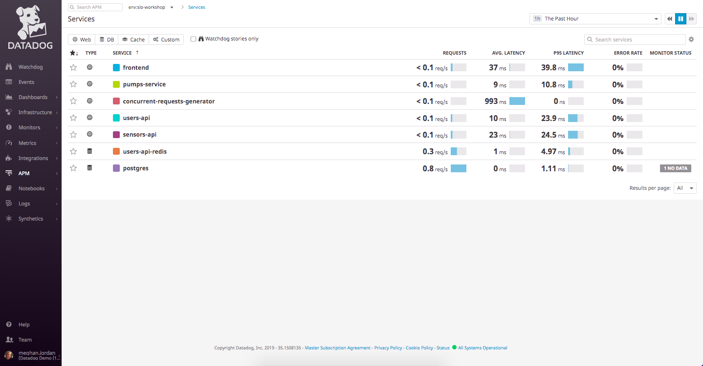

# Starting our Microservices with Docker Compose

This SLO workshop uses multiple docker images in order to build a microservices environment for local development.

We can inspect the `docker-compose.yml` in the SLO workshop folder, and see the exact services we'll be running.

Let's first bring everything up with the following command:
`DD_API_KEY=<api key> docker-compose up`

You'll be able to interact with the web app running on port 5000 in the web browser here:
https://2886795280-5000-ollie01.environments.katacoda.com/

After clicking the link, hop into Datadog, and check to see if your services are there. It may take several minutes for the services to appear. 

Eventually, you'll see the list of services like this:

Remember, you can press CTRL+c and exit your running `docker-compose`.
