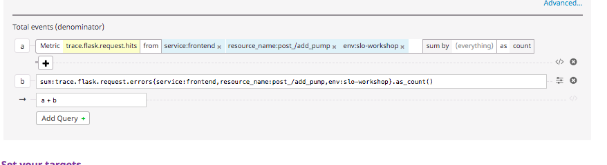
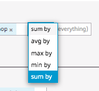

# Create a service level indicator (SLI) and service level objective SLO

Navigate to create a new Service Level Objective. You can get there by clicking through to the subnav item under Monitors or going directly to https://app.datadoghq.com/slo

And New SLO in the top right corner: 

## Identify the SLI 

There are a couple of options for us `Monitor Based` or `Event Based`. But we care about availability and error rate so we'll select `Event Based` under `Define The Source` for our SLI creation. 

First step: In the numerator field select `trace.flask.request.hits` scoped to the service and resource we care about: `service:iot-frontend`, `resource_name:post_/add_pump`, `env:slo-workshop`. The numerator represents all of your “good” (successful) hits.

Second step: Defining the denominator. For this service we need to add a query summing two metrics `trace.flask.request.hits` and `trace.flask.request.errors` to get the total of requests.  

To add a second query: click advanced, change the metric, `sum a + b`

Since there haven’t been any errors, you’ll probably need to edit the query directly by clicking `</>` and entering `trace.flask.request.errors`. 

 

Note: in this editor you’ll want to `sum by` to get the sum of all of your requests rather than an avg of them. 

## Set the SLO 

Next we set our SLO target and time window we are measuring against. 

Select 99% over 30 day time window. 

This means that we are setting an SLO to say that 99% of requests to the `add_pump` endpoint must be successful over 30 days. 

Click save! 

## View your data

Check out your data on the SLO detail page! 

Go back to our water pump app and add generate requests by adding more pumps! 
https://2886795280-5000-ollie01.environments.katacoda.com/

When you first check it out, it’ll likely say 100%. With the nature of the workshop, there aren’t any errors yet. But in our next step we will cause chaos and produce failure in the systems.
